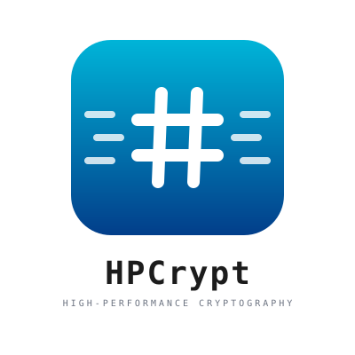

<p align="center">
  
</p>

# HPCrypt

[](LICENSE-MIT)
[](https://www.rust-lang.org/)
[](https://docs.rust-embedded.org/book/intro/no-std.html)

A high-performance cryptography library written in pure Rust, providing state-of-the-art implementations of modern cryptographic primitives with a focus on security, constant-time operations, and performance optimization.

## Key Features

- **High-Performance Implementations** - Optimized using state-of-the-art algorithms and techniques from recent cryptographic research
- **100% Safe Rust** - Memory-safe by design with minimal use of unsafe code (only in performance-critical SIMD operations)
- **Constant-Time Operations** - Protection against timing side-channel attacks for all cryptographic operations
- **no_std Compatible** - Runs in embedded and constrained environments without the standard library
- **Standards Compliant** - Implements NIST FIPS standards and IETF RFCs
- **Post-Quantum Cryptography** - Production-ready ML-KEM, ML-DSA, and SLH-DSA implementations
- **Comprehensive Testing** - Validated against official NIST CAVP/ACVP test vectors, Wycheproof, and RFC test vectors
- **Modular Architecture** - Fine-grained crates for minimal dependencies

## Performance Optimizations

HPCrypt incorporates cutting-edge optimization techniques from recent cryptographic research:

- **Post-Quantum Cryptography (ML-KEM, ML-DSA)** - "[Deferred Reduction Optimizations for Post-Quantum Lattice Cryptography](https://zenodo.org/records/17772583)" - Tarsha Kurdi (2025)
- **GCM Authentication** - "[Efficient GHASH and POLYVAL Implementation](https://eprint.iacr.org/2025/2171)" - Tarsha Kurdi & Möller (2025)
- **AES Implementation** - "[Fixslicing AES-like Ciphers](https://eprint.iacr.org/2020/1123)" - Adomnicai & Peyrin (IACR TCHES 2021)
- **Elliptic Curve Operations** - "[Fast constant-time gcd computation](https://eprint.iacr.org/2019/266)" - Bernstein & Yang (2019)

## Cryptographic Primitives

HPCrypt provides a comprehensive suite of cryptographic algorithms organized into modular crates:

### Symmetric Cryptography

**Hash Functions** ([hpcrypt-hash](hpcrypt-hash/))
- SHA-2 family: SHA-224, SHA-256, SHA-384, SHA-512, SHA-512/256
- SHA-3 family: SHA3-224, SHA3-256, SHA3-384, SHA3-512
- Extendable output: SHAKE128, SHAKE256, TurboShake128, TurboShake256
- BLAKE family: BLAKE2b, BLAKE2s, BLAKE3

**Block Ciphers & Modes** ([hpcrypt-cipher](hpcrypt-cipher/))
- Ciphers: AES-128/192/256 (fixsliced), ChaCha20
- Modes: CBC, CTR, CFB, OFB, XTS (disk encryption)

**Message Authentication Codes** ([hpcrypt-mac](hpcrypt-mac/))
- HMAC (with SHA-2, SHA-3, BLAKE2)
- KMAC128, KMAC256, cSHAKE
- CMAC (AES-based)
- Poly1305, GMAC
- Universal hashes: GHASH, Polyval

**Authenticated Encryption** ([hpcrypt-aead](hpcrypt-aead/))
- AES-GCM, AES-GCM-SIV (nonce misuse-resistant)
- AES-CCM, AES-SIV, AES-EAX, AES-OCB3
- ChaCha20-Poly1305, XChaCha20-Poly1305
- Ascon-128, Ascon-128a (NIST lightweight winner)

**Key Derivation** ([hpcrypt-kdf](hpcrypt-kdf/))
- HKDF, PBKDF2, Argon2 (i/d/id), scrypt
- X9.63 KDF
- TLS 1.2 PRF, TLS 1.3 KDF, QUIC KDF

**Specialized Encryption** ([hpcrypt-fpe](hpcrypt-fpe/))
- Format-Preserving Encryption (FF1) - NIST SP 800-38G

### Public-Key Cryptography

**Elliptic Curves** ([hpcrypt-curves](hpcrypt-curves/))
- Curve25519 (X25519 ECDH, Ed25519 signatures)
- Curve448 (X448 ECDH, Ed448 signatures)
- NIST P-256, P-384, P-521
- secp256k1 (Bitcoin/Ethereum)

**Digital Signatures** ([hpcrypt-signatures](hpcrypt-signatures/))
- Ed25519, Ed448 (EdDSA)
- ECDSA (NIST curves, secp256k1)
- Schnorr signatures (BIP-340)

**RSA** ([hpcrypt-rsa](hpcrypt-rsa/))
- RSAES-OAEP encryption
- RSASSA-PSS and PKCS#1 v1.5 signatures
- 2048, 3072, 4096-bit keys

**Hybrid Encryption** ([hpcrypt-hpke](hpcrypt-hpke/), [hpcrypt-ecies](hpcrypt-ecies/))
- HPKE: Hybrid Public Key Encryption (RFC 9180)
- ECIES: Elliptic Curve Integrated Encryption Scheme (ISO/IEC 18033-2)

### Post-Quantum Cryptography

**ML-KEM** ([hpcrypt-mlkem](hpcrypt-mlkem/)) - FIPS 203
- ML-KEM-512, ML-KEM-768, ML-KEM-1024
- Key encapsulation mechanism (KEM)
- Lattice-based cryptography

**ML-DSA** ([hpcrypt-mldsa](hpcrypt-mldsa/)) - FIPS 204
- ML-DSA-44, ML-DSA-65, ML-DSA-87
- Digital signatures
- Lattice-based (Dilithium)

**SLH-DSA** ([hpcrypt-slhdsa](hpcrypt-slhdsa/)) - FIPS 205
- Stateless hash-based signatures
- Multiple parameter sets (SPHINCS+)

### Password-Authenticated Protocols

**PAKE** ([hpcrypt-pake](hpcrypt-pake/))
- OPAQUE (RFC 9497)
- Resistant to offline dictionary attacks

**SRP** ([hpcrypt-srp](hpcrypt-srp/))
- Secure Remote Password protocol (RFC 2945, RFC 5054)
- Zero-knowledge password proof

### Threshold Cryptography

**Secret Sharing** ([hpcrypt-threshold](hpcrypt-threshold/))
- Shamir's Secret Sharing (1979)
- Split secrets across multiple parties

## Quick Start

```toml
[dependencies]
hpcrypt-aead = "0.1"
hpcrypt-hash = "0.1"
hpcrypt-mldsa = "0.1"
```

### Authenticated Encryption (AES-GCM)

```rust
use hpcrypt_aead::{Aes256Gcm, Aead};
use hpcrypt_rng::OsRng;

// Generate random key and nonce
let key = OsRng::generate_bytes::<32>();
let nonce = OsRng::generate_bytes::<12>();

// Encrypt with authentication
let cipher = Aes256Gcm::new(&key);
let plaintext = b"Secret message";
let ciphertext = cipher.encrypt(&nonce, plaintext, b"additional data")?;

// Decrypt and verify
let recovered = cipher.decrypt(&nonce, &ciphertext, b"additional data")?;
assert_eq!(recovered, plaintext);
```

### Post-Quantum Digital Signatures (ML-DSA)

```rust
use hpcrypt_mldsa::{MlDsa65, keygen};

// Generate quantum-resistant keypair
let (public_key, secret_key) = keygen::<MlDsa65>();

// Sign message
let message = b"Future-proof signature";
let signature = secret_key.sign(message)?;

// Verify signature
assert!(public_key.verify(message, &signature));
```

### Cryptographic Hashing (SHA-3)

```rust
use hpcrypt_hash::{Sha3_256, Hash};

let data = b"Data to hash";
let digest = Sha3_256::digest(data);

println!("SHA3-256: {:?}", digest);
```

### Key Derivation (Argon2)

```rust
use hpcrypt_kdf::{Argon2id, Argon2Params};

let password = b"user_password";
let salt = b"random_salt_16bt";

// Derive key from password
let params = Argon2Params::default();
let mut key = [0u8; 32];
Argon2id::derive_key(password, salt, &params, &mut key)?;
```

## Design Principles

### Security First

**Constant-Time Operations**
- All cryptographic operations resist timing side-channel attacks
- Constant-time comparisons and conditional operations prevent timing leaks
- No data-dependent branches in critical code paths

**Memory Safety**
- Written in safe Rust with minimal unsafe code (limited to performance-critical SIMD)
- Automatic zeroization of sensitive data on drop via `zeroize` crate
- No buffer overflows or use-after-free vulnerabilities

**Standards Compliance**
- Validated against official NIST CAVP/ACVP test vectors
- Tested with Wycheproof for edge cases and known attacks
- RFC test vectors for protocol implementations

### Modular Architecture

**Clean Separation of Concerns**
- `hpcrypt-cipher`: Block ciphers and modes of operation
- `hpcrypt-mac`: Message authentication codes and universal hashes
- `hpcrypt-aead`: Authenticated encryption (combines cipher + MAC)

**Acyclic Dependencies**
```
hpcrypt-cipher → hpcrypt-mac → hpcrypt-aead
```
This hierarchy eliminates circular dependencies and provides clear module boundaries.

**Primitives Over Protocols**
- Protocol-specific functions (TLS KDF, QUIC header protection) live in primitive crates
- Reduces crate proliferation while maintaining functionality
- Example: QUIC KDF is in `hpcrypt-kdf`, not a separate `hpcrypt-quic` crate

### no_std Support

All crates support embedded and constrained environments:

```toml
[dependencies]
hpcrypt-hash = { version = "0.1", default-features = false }
hpcrypt-aead = { version = "0.1", default-features = false, features = ["alloc"] }
```

- `std` (default): Full standard library support
- `alloc`: Heap allocation without std

## Development

### Testing

Run all tests including CAVP, RFC, and Wycheproof test vectors:

```bash
# All tests
cargo test --workspace --all-features

# Specific crate
cargo test -p hpcrypt-mldsa
cargo test -p hpcrypt-aead
```

### Benchmarks

```bash
cargo bench
```

### Code Quality

```bash
cargo fmt --all
cargo clippy --workspace --all-features -- -D warnings
```

## Requirements

**Minimum Supported Rust Version (MSRV)**: 1.70+

## Contributing

Contributions are welcome! Please ensure:

1. All tests pass: `cargo test --workspace --all-features`
2. Code is properly formatted: `cargo fmt --all`
3. No clippy warnings: `cargo clippy --workspace --all-features -- -D warnings`
4. New features include tests and documentation
5. Changes maintain constant-time properties for cryptographic operations

## License

Dual-licensed under your choice of:

- Apache License, Version 2.0 ([LICENSE-APACHE](LICENSE-APACHE) or <http://www.apache.org/licenses/LICENSE-2.0>)
- MIT License ([LICENSE-MIT](LICENSE-MIT) or <http://opensource.org/licenses/MIT>)

## References

### Standards
- NIST FIPS: 180-4 (SHA-2), 186-4 (DSA/ECDSA), 197 (AES), 198-1 (HMAC), 202 (SHA-3), 203 (ML-KEM), 204 (ML-DSA), 205 (SLH-DSA)
- NIST Special Publications: SP 800-38A (Block Cipher Modes), SP 800-38G (FPE), SP 800-185 (KMAC/cSHAKE)
- IETF RFCs: 2104 (HMAC), 2898 (PBKDF2), 5869 (HKDF), 7539 (ChaCha20-Poly1305), 8032 (EdDSA), 8017 (RSA), 9106 (Argon2), 9180 (HPKE), 9497 (OPAQUE)

### Testing
- [NIST CAVP/ACVP](https://csrc.nist.gov/projects/cryptographic-algorithm-validation-program) - Official test vectors
- [Google Wycheproof](https://github.com/google/wycheproof) - Known attack vectors and edge cases
